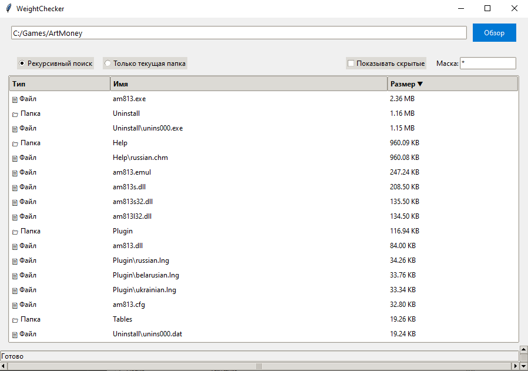

# WeightChecker

## Описание
Приложение для анализа занимаемого места на диске с графическим интерфейсом. Позволяет быстро оценить размеры файлов и папок с возможностью детальной навигации.

## Особенности
- ✔️ Два режима сканирования:
  - **Рекурсивный** (включая все подпапки)
  - **Только текущая директория**
- ✔️ Интеллектуальная сортировка:
  - По типу элемента
  - По имени
  - По размеру
- ✔️ Поиск по маске формата
- ✔️ Поиск скрытх элементов
- ✔️ Интеграция с проводником:
  - Открытие папок двойным кликом
  - Контекстное меню для быстрого доступа
- ✔️ Кроссплатформенный интерфейс
- ✔️ Оптимизированная работа с большими директориями
- ✔️ Прогресс бар сканирования

## Требования
- ✔️ Python 3.8+
- ✔️ Поддерживаемые ОС:
  - Windows 10+

## Вклад в проект
- Приветствуются пул-реквесты и сообщения об ошибках. Основные правила:
- Соответствие стилю PEP8
- Комментирование сложных участков кода
- Тестирование изменений перед отправкой
- Использование английского языка для названий переменных

Автор: VAUsIGT
Версия: 1.7.1
Дата: 27.02.2024
